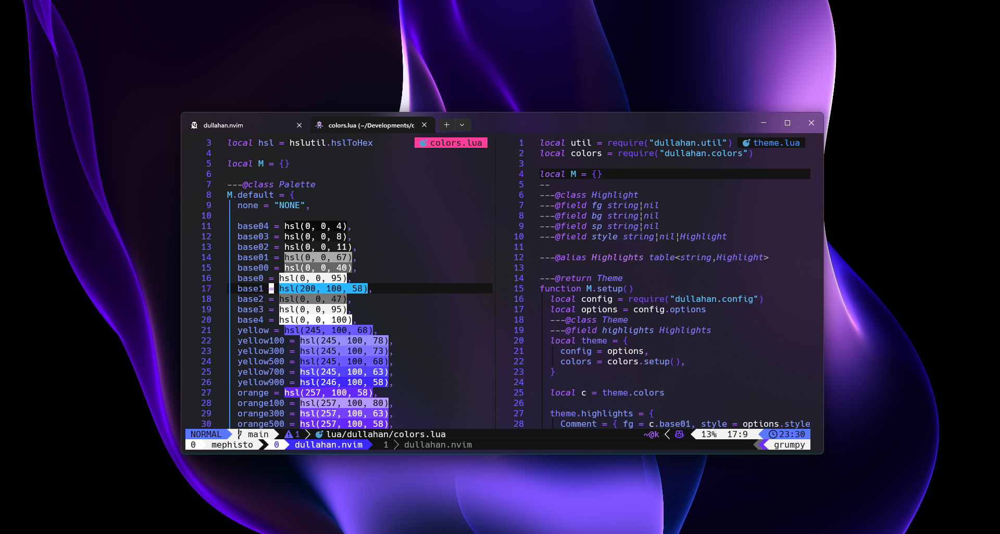
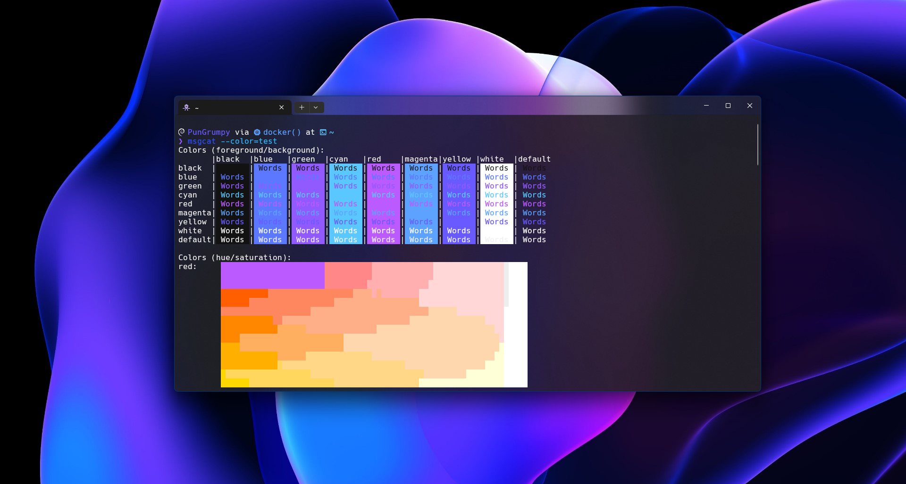

<div align="center">
    <h1><code>🐇</code> Mephsito Dotfiles</h1>
    <p>My personal dotfiles for macOS and Linux</p>
    
</div>

## `💻` Preview

<div align="center">
  <div>
    
    <p>
      <button style="background-color: #1d1f21; color: #c5c8c6; border: 1px solid #373b41; border-radius: 3px; padding: 5px 10px; font-size: 14px; cursor: pointer;" onclick="window.open('.config/nvim', '_blank')">
        Neovim configuration
      </button>
    </p>
  </div>
  <div>
    
    <p>
      <button style="background-color: #1d1f21; color: #c5c8c6; border: 1px solid #373b41; border-radius: 3px; padding: 5px 10px; font-size: 14px; cursor: pointer;" onclick="window.open('.config/fish', '_blank')">
        Fish Shell configuration
      </button>
    </p>
  </div>
</div>

## `📝` Content

- 🐟 Shell
- 🐙 Git

## `🐟` Shell (🍎 & 🐧)

- [Starship](https://starship.rs/) - The minimal, blazing-fast, and infinitely customizable prompt for any shell
- [Nerd Font](https://www.nerdfonts.com/) - A collection of over 50 patched fonts
- [Homebrew](https://brew.sh/) - The missing package manager for macOS (or Linux)
- [Fish Shell](https://fishshell.com/) - A smart and user-friendly command line shell
  - [Fisher](https://github.com/jorgebucaran/fisher) - A plugin manager for Fish Shell `curl -sL https://git.io/fisher | source && fisher install jorgebucaran/fisher`
  - [Z for fish](https://github.com/jethrokuan/z) - Directory jumping `fisher install jethrokuan/z`
  - [Fzf for fish](https://github.com/PatrickF1/fzf.fish) - Interactive filtering `fisher install PatrickF1/fzf.fish`
  - [Puffer for fish](https://github.com/nickeb96/puffer-fish) - Text expander `fisher install nickeb96/puffer-fish`
  - [Pisces for fish](https://github.com/laughedelic/pisces) - Paired symbols `fisher install laughedelic/pisces`
  - [SSH Agent](https://github.com/danhper/fish-ssh-agent) - SSH agent `fisher install danhper/fish-ssh-agent`
- [Eza](https://eza.rocks/) - A modern replacement for `ls`
- [Peco](https://peco.github.io/) - A simplistic interactive filtering tool
- [Fzf](https://github.com/junegunn/fzf) - A command-line fuzzy finder
- [Ghq](https://github.com/x-motemen/ghq) - A remote repository management tool
- [Ripgrep](https://github.com/BurntSushi/ripgrep) - A line-oriented search tool that recursively searches your current directory for a regex pattern

## `🐙` Git

- [Coventional Message](https://www.npmjs.com/package/cz-conventional-changelog) - A commitizen adapter following the conventional-changelog convention `npm install -g cz-conventional-changelog`

## `📦` Setup

```bash
curl -sL https://raw.githubusercontent.com/Mephisto-Grumpy/dotfiles/main/build | bash
```

## `📝` License

Licensed under the [WTFPL](LICENSE) License.
